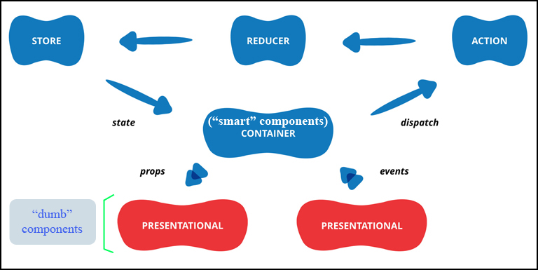
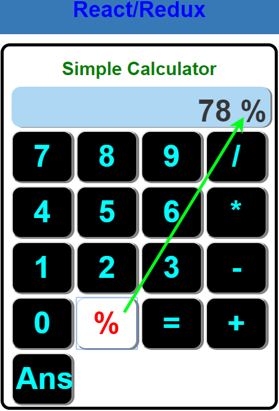

# Calculator with React/Redux

## Aim

> + To build a very simple **Calculator** using **React/Redux**. There will be no **Business** or **DataSource** layers to record the results.
> + Main propose: practice more and more **React/Redux**'s architecture. This project is simple enough to be understood easily and complexe enough to be interesting ...
> 
### This project respect totally the following architecture of React/Redux: 

## User Interface
 

## Note
> * Bugs Solved! No more bugs?
> * This is just a project with 8 hours of development ...

## Execution
1. Clone the project into your computer
2. Execute: "**npm install**" to install dependencies
3. Execute: "**npm run build**"
4. (Open your browser) and enter: "**localhost:8080/dist**"

## Author
* Dinh HUYNH - All Rights Reserved!
* dinh.hu19@yahoo.com